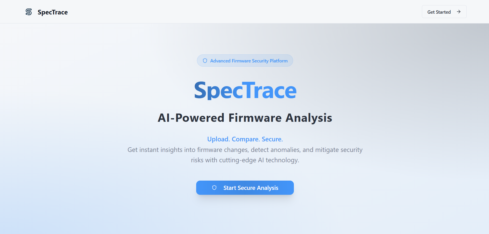
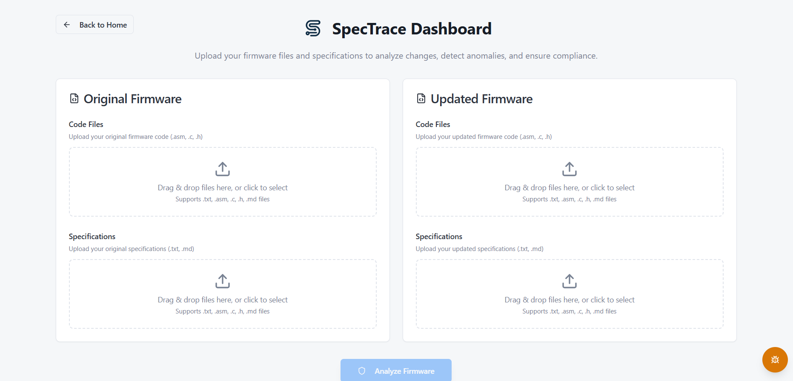
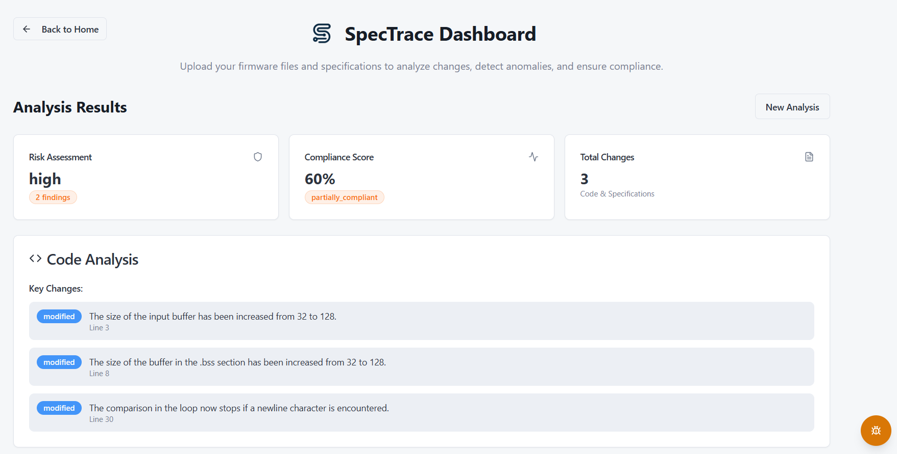
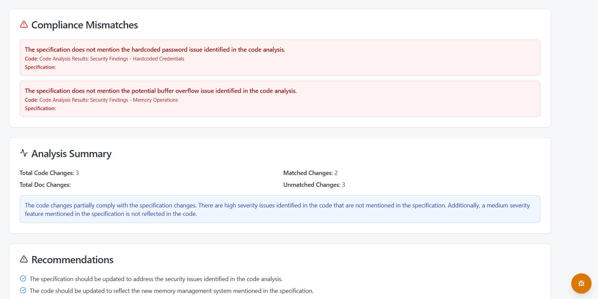

# SpecTrace

> AI-Powered Firmware Security Analysis Platform

SpecTrace is an advanced firmware security analysis platform that leverages cutting-edge AI algorithms and Ghidra decompilation to analyze and compare firmware code, detect anomalies, and provide comprehensive security insights.



## 🚀 Features

- **🔧 Binary Decompilation**: Ghidra-powered binary analysis and decompilation to assembly/C code
- **AI-Powered Analysis**: Advanced algorithms compare code changes and analyze specifications
- **Security Compliance**: Automated validation of security compliance standards  
- **Dual Mode Support**: Text files or binary files with automatic decompilation
- **Intuitive Interface**: Modern, responsive dashboard built with React and TypeScript
- **Real-time Progress**: Live progress tracking during analysis operations
- **Multi-file Support**: Upload and compare multiple firmware files and specifications
- **Comprehensive Reports**: Detailed analysis results with actionable recommendations

## 📁 Project Structure

```
spectrace/
├── api/                    # FastAPI backend
├── dashboard/              # React/Vite frontend
├── Files/                  # Sample files for testing
└── images/                 # Screenshots and assets
```

## 🛠️ Tech Stack

### Backend (API)
- **Framework**: FastAPI
- **Language**: Python 3.8+
- **AI Integration**: OpenAI GPT-4
- **Binary Analysis**: Ghidra Headless Analyzer
- **Testing**: pytest

### Frontend (Dashboard)
- **Framework**: React 18 + TypeScript
- **Build Tool**: Vite
- **Styling**: Tailwind CSS
- **UI Components**: Radix UI + shadcn/ui
- **State Management**: TanStack Query

## 📋 Prerequisites

### Option 1: Docker (Recommended)
- Docker and Docker Compose
- OpenAI API Key

### Option 2: Manual Installation
- Python 3.11+
- Node.js 18+
- npm or yarn
- Java 17+ (for Ghidra)
- Ghidra 11.0.3+ (for binary analysis)
- OpenAI API Key

## 🚀 Quick Start

### Option 1: Docker Installation (Recommended)

1. **Clone the repository and navigate to the project:**
```bash
git clone <repository-url>
cd spectrace
```

2. **Create environment file:**
```bash
# Create .env file in the root directory
echo "OPENAI_API_KEY=your_openai_api_key_here" > .env
```

3. **Build and run with Docker Compose:**
```bash
docker-compose up --build
```

This will:
- Build the API container with Ghidra pre-installed
- Start the frontend development server
- Set up all required dependencies automatically

**Services will be available at:**
- API: `http://localhost:8000`
- Frontend: `http://localhost:5173`
- API Documentation: `http://localhost:8000/docs`

### Option 2: Manual Installation

#### Prerequisites Setup

**Install Ghidra:**
1. Download Ghidra 11.0.3 from: https://github.com/NationalSecurityAgency/ghidra/releases
2. Extract to `/opt/ghidra` (Linux/Mac) or `C:\ghidra` (Windows)
3. Ensure Java 17+ is installed and `JAVA_HOME` is set
4. Add Ghidra's `support` directory to your PATH

**Environment Variables:**
```bash
export GHIDRA_INSTALL_DIR=/opt/ghidra  # Adjust path as needed
export JAVA_HOME=/usr/lib/jvm/java-17-openjdk-amd64  # Adjust path as needed
```

### 1. Backend Setup (API)

Navigate to the API directory and install dependencies:

```bash
cd api
pip install -r requirements.txt
```

Create a `.env` file in the `api` directory with your OpenAI API key:

```bash
OPENAI_API_KEY=your_openai_api_key_here
```

Start the backend server:

```bash
python main.py
```

The API will be available at `http://localhost:8000`

### 2. Frontend Setup (Dashboard)

Navigate to the dashboard directory and install dependencies:

```bash
cd dashboard
npm install
```

Start the development server:

```bash
npm run dev
```

The dashboard will be available at `http://localhost:5173`

## 🎯 How to Use

### 1. Choose Analysis Mode

Select between two analysis modes in the dashboard:
- **📄 Text Files**: Upload source code files directly (.asm, .c, .h)
- **🔧 Binary Files**: Upload binary firmware files (.bin, .elf, .exe, .hex) for automatic decompilation

### 2. Upload Files

Upload your firmware files and specifications through the intuitive dashboard interface:



### 3. AI Analysis

The platform automatically:
- **Decompiles binaries** (if binary mode selected) using Ghidra
- Compares code changes between versions
- Analyzes specification updates
- Validates security compliance
- Generates comprehensive results

### 3. View Results

Get detailed insights with comprehensive analysis results:





## 📊 API Endpoints

The API provides the following endpoints:

### Binary Analysis
- **`POST /api/v1/decompile`** - Decompile binary files using Ghidra (NEW)
  - Accepts: Binary files (.bin, .elf, .exe, .hex)
  - Returns: Assembly and decompiled C code

### Code Analysis  
- **`POST /api/v1/compare-code`** - Compare firmware code files
- **`POST /api/v1/compare-specs`** - Compare specification files  
- **`POST /api/v1/validate-compliance`** - Validate security compliance

Visit `http://localhost:8000/docs` for the interactive API documentation.

### Supported Binary Formats
- **ELF**: Linux executables and embedded firmware
- **PE**: Windows executables  
- **Mach-O**: macOS executables
- **Raw Binary**: Custom firmware images (.bin, .hex)
- **Intel HEX**: Embedded firmware format

## 🧪 Testing

### Backend Tests
```bash
cd api
pytest
```

### Frontend Linting
```bash
cd dashboard
npm run lint
```

### Custom Test Configuration
```bash
cd api
python run_tests.py
```

## 🔧 Available Scripts

### Backend (API)
- `python main.py` - Start the development server
- `pytest` - Run tests
- `python run_tests.py` - Run tests with custom configuration

### Frontend (Dashboard)
- `npm run dev` - Start development server
- `npm run build` - Build for production
- `npm run lint` - Run ESLint
- `npm run preview` - Preview production build

## 🏗️ Development

1. Make sure both backend and frontend are running
2. The frontend is configured to proxy API requests to the backend
3. Changes to the frontend will hot-reload automatically
4. Backend changes require restarting the Python server

## 👥 Team

This project was developed by the following team members for the **AI Cybersecurity Hackathon - Sponsored by SAP & KPMG**:

- **Richard Meinsen**
- **Joseph Chris Adrian**
- **Javier Peres**
- **Julian Stosse**

## 🤝 Contributing

1. Fork the repository
2. Create a feature branch (`git checkout -b feature/amazing-feature`)
3. Commit your changes (`git commit -m 'Add amazing feature'`)
4. Push to the branch (`git push origin feature/amazing-feature`)
5. Open a Pull Request

## 📝 License

This project is part of the **AI Cybersecurity Hackathon - Sponsored by SAP & KPMG**.

## 📧 Support

For questions or support, please contact the development team.

---

**SpecTrace** - Revolutionizing Firmware Security with AI 🛡️

*Built for the AI Cybersecurity Hackathon - Sponsored by SAP & KPMG*