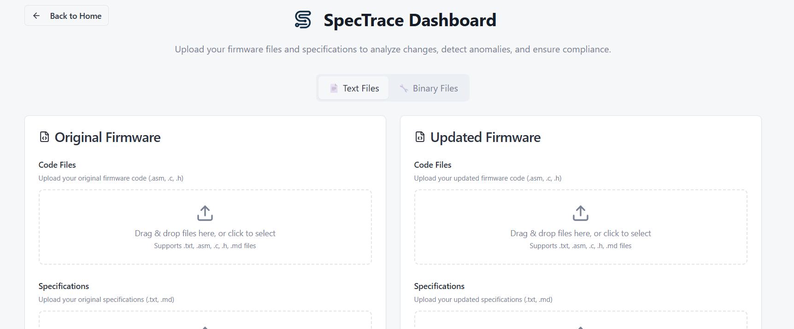

# SpecTrace - state of this repo / hackathon result  

The repo “spectrace” ( https://github.com/stoyse/spectrace/ ) was created during an AI security hackathon as a team repo. This text change commit corrects and clarifies some things and will most likely be the last one before the project is archived.

The idea and workflow for the project was drafted by Richard Meinsen and presented to Joseph Chris Adrian before the hackathon. As a data scientist he decided to stay in the team but to work with synthetic data on another aspect as the concept did not offer data for machine learning. 

During the hackathon the concept was presented to Julian Stosse and Javier Peres. Julian Stosse and Richard Meinsen then verified the concept by manual workflow execution and manually writing the prompts. They successfully proved that the concept can work, and shared all the results in the team. 
The concept can be helpful to support software / firmware development. The approach would be most useful & usable when implemented as cli or via scripts -> usable in CI/CD.

Without discussion with the team Javier Peres decided to make it a web app and vibe coded that web app on the evening of day 1 based on the explanations and information he had received from the team.
On day 2 the team was in the situation that Javier had put the source not in the agreed upon team repo but in his own repo where the team had no access, also without mentioning the team members in the files.
Richard made clear that mentioning the team members was necessary, as well as using the team repo that all the team had access to.
Besides other problems Javier Peres repeatedly force pushed on the team repo, effectively removing the work from the repo that others had pushed.
For other hackathon team members the resulting experience is totally bitter.

It is useless to continue with this repo as the vibe coded web app looks shiny but does not work correctly (bad for presenting) while the basic workflow worked fine. Further the workflow should not be implemented as a web app with point and click file uploads as this does not align with professional software development workflows and CI/CD.

Further the claim "SpecTrace is an AI-powered firmware security analysis platform that decompiles binary firmware files using Ghidra and performs intelligent code comparison to identify security vulnerabilities, compliance issues, and behavioral changes between firmware versions. The application combines automated binary analysis with OpenAI GPT-4 to provide detailed" is quite exaggerated as a) the so far pushed state of code does not work correctly what made it also not presentable working (but what would have worked as tested for the validation) and b) the web workflow is not really usable for firmware development or in general software development.

One can take the work of others, wrap it cheap and shiny, and promote oneself with that as an inventive creator. That's not new. But in the end it just wastes time and resources.

Making this state clear in this public repo is the only way to make sure there is also not much profit for Javier Peres from this. It will not make the time losses and the ruined hackathon for the other team members any better. The hope is, that some others will notice that such an egoistic approach can cause problems and will refrain from it.

See also
- https://github.com/peres84/specTrace
- https://github.com/hackathon-develop/spectrace-rescuefork-after-repeated-deletions-of-team-work-through-force-push


# --------------------------------------------------------------------------------------


# 🛡️ SpecTrace

> **AI-Powered Firmware Security Analysis Platform with Binary Decompilation**

SpecTrace is an advanced cybersecurity platform that combines cutting-edge AI algorithms with Ghidra's powerful binary analysis capabilities to provide comprehensive firmware security analysis, vulnerability detection, and compliance validation.


---

## 🎯 **Overview**

SpecTrace revolutionizes firmware security analysis by offering both **text-based** and **binary-based** analysis workflows. Upload source code or binary firmware files, and get detailed security insights powered by OpenAI's GPT-4 and NSA's Ghidra decompiler.

### 🔥 **Key Capabilities**

- **🔧 Binary Decompilation**: Convert firmware binaries to readable assembly/C code using Ghidra
- **🤖 AI Security Analysis**: GPT-4 powered vulnerability detection and risk assessment
- **📊 Compliance Validation**: Automated security compliance checking
- **📈 Change Analysis**: Compare firmware versions and track modifications
- **🎨 Modern Interface**: Intuitive React dashboard with real-time progress tracking

---

## 🚀 **Features**

### **Binary Analysis**

- **Multi-Format Support**: ELF, PE, Mach-O, Intel HEX, raw binaries
- **Architecture Detection**: Automatic CPU architecture identification
- **Decompilation**: Assembly disassembly and high-level C code generation
- **Metadata Extraction**: Compiler info, build details, and binary characteristics

### **Security Analysis**

- **Vulnerability Detection**: Buffer overflows, hardcoded credentials, memory issues
- **Risk Assessment**: CRITICAL, HIGH, MEDIUM, LOW severity classification
- **Pattern Recognition**: Common attack vectors and security anti-patterns
- **Compliance Checking**: Industry standard security requirement validation

### **Analysis Workflows**

- **Text Mode**: Direct source code analysis (.asm, .c, .h files)
- **Binary Mode**: Automatic decompilation + analysis workflow
- **Dual Comparison**: Compare old vs new firmware versions
- **Specification Validation**: Ensure code matches documentation

### **User Experience**

- **Drag & Drop Upload**: Intuitive file handling
- **Real-Time Progress**: Live analysis status with detailed steps
- **Comprehensive Reports**: Detailed findings with actionable recommendations
- **Debug Panel**: Development insights and API call monitoring

---

## 📁 **Architecture**

```
spectrace/
├── 📁 api/                     # FastAPI Backend
│   ├── 📁 services/            # Core analysis services
│   │   ├── ghidra_service.py   # Binary decompilation
│   │   ├── code_analyzer.py    # AI code analysis
│   │   ├── spec_analyzer.py    # Specification analysis
│   │   └── compliance_analyzer.py # Compliance validation
│   ├── 📁 routes/              # API endpoints
│   ├── 📁 middleware/          # Error handling & logging
│   ├── 📁 tests/              # Automated tests
│   └── 📄 main.py             # Application entry point
├── 📁 dashboard/               # React Frontend
│   ├── 📁 src/
│   │   ├── 📁 pages/          # Main application pages
│   │   ├── 📁 components/     # Reusable UI components
│   │   ├── 📁 lib/           # Utility functions
│   │   └── 📁 hooks/         # Custom React hooks
├── 📁 features/               # Feature documentation
├── 📁 docs/                  # Installation & setup guides
├── 📁 files/                 # Sample test files
├── 📁 images/                # Screenshots & assets
├── 🐳 Dockerfile             # Container configuration
├── 🐳 docker-compose.yml     # Multi-service orchestration
└── 📄 README.md              # This file
```

---

## 🛠️ **Technology Stack**

### **Backend (API)**

| Component           | Technology     | Purpose                      |
| ------------------- | -------------- | ---------------------------- |
| **Framework**       | FastAPI        | High-performance async API   |
| **Language**        | Python 3.11+   | Core application logic       |
| **AI Engine**       | OpenAI GPT-4   | Security analysis & insights |
| **Binary Analysis** | Ghidra 11.0.3+ | Firmware decompilation       |
| **Database**        | In-memory      | Session state management     |
| **Testing**         | pytest         | Automated testing            |

### **Frontend (Dashboard)**

| Component            | Technology            | Purpose                     |
| -------------------- | --------------------- | --------------------------- |
| **Framework**        | React 18 + TypeScript | User interface              |
| **Build Tool**       | Vite                  | Fast development & building |
| **Styling**          | Tailwind CSS          | Responsive design           |
| **Components**       | shadcn/ui + Radix UI  | Accessible components       |
| **State Management** | React Hooks           | Application state           |
| **HTTP Client**      | Fetch API             | Backend communication       |

### **Infrastructure**

| Component            | Technology              | Purpose                  |
| -------------------- | ----------------------- | ------------------------ |
| **Containerization** | Docker + Docker Compose | Deployment & development |
| **Web Server**       | Uvicorn                 | ASGI server              |
| **Reverse Proxy**    | Built-in CORS           | Cross-origin requests    |
| **File Storage**     | Local filesystem        | Temporary file handling  |

---

## 📋 **Prerequisites**

### **For All Platforms**

- **OpenAI API Key** (required for AI analysis)
- **Internet Connection** (for AI API calls and package downloads)
- **4GB+ RAM** (for Ghidra binary analysis)
- **2GB+ Disk Space** (for Ghidra installation and temporary files)

### **Platform-Specific Requirements**

| Platform       | Requirements                                   | Installation Guide                      |
| -------------- | ---------------------------------------------- | --------------------------------------- |
| **🪟 Windows** | Python 3.11+, Node.js 18+, Java 17+, Git       | [📖 Windows Setup](WINDOWS_SETUP.md)    |
| **🍎 macOS**   | Python 3.11+, Node.js 18+, Java 17+, Homebrew  | [📖 macOS Setup](MACOS_SETUP.md)        |
| **🐧 Linux**   | Python 3.11+, Node.js 18+, Java 17+, wget/curl | [📖 Linux Setup](LINUX_SETUP.md)        |
| **🐳 Docker**  | Docker Desktop or Docker Engine                | [📖 Docker Setup](#docker-installation) |

---

## 🚀 **Quick Start**

### **🐳 Docker Installation (Recommended)**

**Fastest way to get started with zero configuration:**

```bash
# 1. Clone the repository
git clone https://github.com/your-repo/spectrace.git
cd spectrace

# 2. Create environment configuration
echo "OPENAI_API_KEY=your_openai_api_key_here" > .env

# 3. Launch the platform
docker-compose up --build
```

**🎉 Access the application:**

- **Dashboard**: http://localhost:5173
- **API**: http://localhost:8000
- **API Docs**: http://localhost:8000/docs

### **💻 Manual Installation**

Choose your platform-specific guide:

- **🪟 Windows**: [Follow Windows Setup Guide](WINDOWS_SETUP.md)
- **🍎 macOS**: [Follow macOS Setup Guide](MACOS_SETUP.md)
- **🐧 Linux**: [Follow Linux Setup Guide](LINUX_SETUP.md)

---

## 🎯 **Usage Guide**

### **Step 1: Choose Analysis Mode**



**📄 Text Mode**: Upload source code files directly

- Supported: `.asm`, `.c`, `.h`, `.txt` files
- Use case: When you have firmware source code

**🔧 Binary Mode**: Upload firmware binaries for decompilation

- Supported: `.bin`, `.elf`, `.exe`, `.hex` files
- Use case: When you only have compiled firmware

### **Step 2: Upload Files**


**Required Files:**

- **Firmware Files**: 2 versions (original + updated)
- **Specifications**: 2 versions (original + updated documentation)

**File Size Limits:**

- **Text files**: 50MB max
- **Binary files**: 100MB max
- **Specifications**: 10MB max

### **Step 3: Analysis Process**


The platform automatically:

1. **🔍 Prepares Analysis**: Validates files and sets up environment
2. **🔧 Decompiles Binaries**: Converts binaries to readable code (if binary mode)
3. **📊 Analyzes Code**: AI-powered security analysis and comparison
4. **📝 Processes Specs**: Documentation analysis and change detection
5. **✅ Validates Compliance**: Checks code-to-spec alignment
6. **📋 Generates Report**: Comprehensive results with recommendations

### **Step 4: Review Results**


**Report Sections:**

- **🚨 Security Findings**: Vulnerabilities with severity ratings
- **📈 Risk Assessment**: Overall security posture
- **🔄 Change Analysis**: Code modifications and their impact
- **📋 Compliance Status**: Documentation alignment score
- **💡 Recommendations**: Actionable security improvements

---

## 📊 **API Reference**

### **Binary Analysis Endpoints**

```http
POST /api/v1/decompile
Content-Type: multipart/form-data

# Upload binary file for decompilation
# Returns: Assembly code + decompiled C code
```

### **Code Analysis Endpoints**

```http
POST /api/v1/compare-code
Content-Type: application/json

# Compare two firmware code versions
# Returns: Security findings + risk assessment
```

### **Specification Analysis Endpoints**

```http
POST /api/v1/compare-specs
Content-Type: application/json

# Compare two specification versions
# Returns: Feature changes + behavioral analysis
```

### **Compliance Validation Endpoints**

```http
POST /api/v1/validate-compliance
Content-Type: application/json

# Validate code-to-specification alignment
# Returns: Compliance score + mismatches
```

**📚 Full API Documentation**: http://localhost:8000/docs

---

## 🔧 **Supported Binary Formats**

| Format         | Extension        | Architecture   | Use Case                        |
| -------------- | ---------------- | -------------- | ------------------------------- |
| **ELF**        | `.elf`           | Linux/Embedded | Linux executables, IoT firmware |
| **PE**         | `.exe`, `.dll`   | Windows        | Windows programs, drivers       |
| **Mach-O**     | `.app`, `.dylib` | macOS          | macOS applications              |
| **Intel HEX**  | `.hex`, `.ihex`  | Embedded       | Microcontroller firmware        |
| **Raw Binary** | `.bin`, `.img`   | Various        | Custom firmware images          |
| **S-Record**   | `.s19`, `.srec`  | Embedded       | Motorola S-record format        |

---

## 🧪 **Testing**

### **Run Backend Tests**

```bash
cd api
pytest -v                    # Run all tests
pytest tests/test_ghidra*    # Test Ghidra integration
python run_tests.py          # Custom test configuration
```

### **Run Frontend Tests**

```bash
cd dashboard
npm test                     # Run React tests
npm run lint                 # Check code quality
npm run type-check          # TypeScript validation
```

### **Integration Testing**

```bash
# Test complete workflow with sample files
cd api
python -c "
import asyncio
from services.ghidra_service import GhidraDecompiler

async def test():
    decompiler = GhidraDecompiler()
    print('✅ Ghidra integration ready!')

asyncio.run(test())
"
```

---

## 🛠️ **Development**

### **Development Setup**

```bash
# 1. Clone and setup
git clone https://github.com/your-repo/spectrace.git
cd spectrace

# 2. Backend development
cd api
pip install -r requirements.txt
python main.py

# 3. Frontend development
cd dashboard
npm install
npm run dev
```

### **Available Scripts**

**Backend (API)**

```bash
python main.py              # Start development server
pytest                      # Run tests
python run_tests.py         # Custom test runner
uvicorn main:app --reload   # Alternative server start
```

**Frontend (Dashboard)**

```bash
npm run dev                 # Development server
npm run build              # Production build
npm run preview            # Preview production build
npm run lint               # Code linting
npm run type-check         # TypeScript checking
```

### **Environment Variables**

```bash
# Required
OPENAI_API_KEY=sk-...       # Your OpenAI API key

# Optional
GHIDRA_INSTALL_DIR=/opt/ghidra    # Ghidra installation path
JAVA_HOME=/usr/lib/jvm/java-17    # Java installation path
DEBUG=true                        # Enable debug logging
```

## 👥 **Team**

**SpecTrace** was developed by the following team for the **AI Cybersecurity Hackathon - Sponsored by SAP & KPMG**:

- **Richard Meinsen**
- **Joseph Chris Adrian**
- **Javier Peres**
- **Julian Stosse**

---

## 📝 **License**


This project is licensed under the **GPL v3** - see https://www.gnu.org/licenses/gpl-3.0.en.html and [LICENSE](LICENSE) file for details.

**Copyright © 2025 SpecTrace Team Hackathon**

---

**🛡️ SpecTrace - Revolutionizing Firmware Security with AI**

_Built with ❤️ for the cybersecurity community_

[](https://github.com/your-repo/spectrace)
[](https://hub.docker.com/r/spectrace/api)
[](https://opensource.org/licenses/MIT)

[🌐 Website](https://spectrace.dev) • [📖 Documentation](https://docs.spectrace.dev) • [💬 Community](https://discord.gg/spectrace) • [🐦 Twitter](https://twitter.com/spectrace_dev)

</div>
